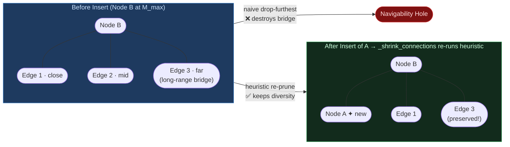

# HNSW Vector Index — Architectural Reference

A from-scratch implementation of the **Hierarchical Navigable Small World (HNSW)** algorithm as described in Malkov & Yashunin (2018). This document is an architectural deep-dive into the graph-theoretic, probabilistic, and algorithmic invariants that make the data structure work.

---

## Table of Contents

1. [Architectural Abstract](#1-architectural-abstract)
2. [Mathematical Foundations](#2-mathematical-foundations)
3. [Algorithmic Invariants](#3-algorithmic-invariants)
4. [Visualizing the Architecture](#4-visualizing-the-architecture)
5. [Complexity Analysis](#5-complexity-analysis)
6. [Configuration Reference](#6-configuration-reference)
7. [Quick Start](#7-quick-start)

---

## 1. Architectural Abstract

HNSW is a **multi-layer proximity graph** for approximate nearest-neighbour (ANN) search. Its structural inspiration is the probabilistic skip list: at each layer, only a geometrically decaying fraction of nodes are present, providing long-range "highway" edges at the top and short-range dense edges at the bottom. A query traverses this hierarchy top-down, using coarse long-range links to teleport near the target, then refining with exhaustive beam search in the dense base layer.

The data structure is defined by three primary configuration parameters:

| Symbol      | Parameter                       | Role                                                                                                                     |
| ----------- | ------------------------------- | ------------------------------------------------------------------------------------------------------------------------ |
| $M$         | `M`                             | Maximum out-degree per node in upper layers. Controls graph connectivity and recall.                                     |
| $\text{ef}$ | `ef_search` / `ef_construction` | Beam width — the size of the dynamic candidate set during search or construction. Controls the recall-latency trade-off. |
| $m_L$       | `m_L`                           | Layer assignment normalisation factor. Governs the probability distribution over layer levels. Defaults to $1 / \ln M$.  |

Two additional bounds enforce degree constraints: `M_max` (upper-layer ceiling, defaults to $M$) and `M_max0` (layer-0 ceiling, defaults to $2M$, reflecting the denser neighbourhood required at the base).

---

## 2. Mathematical Foundations

### 2.1 Probabilistic Layer Assignment

When a new node is inserted, its maximum layer $l$ is drawn from a geometric distribution:

$$l = \left\lfloor -\ln(U) \cdot m_L \right\rfloor, \quad U \sim \text{Uniform}(0, 1)$$

This is implemented directly in `_sample_level()`:

```python
value = random.uniform(0.0, 1.0)
return int(math.floor(-math.log(value) * self.m_L))
```

**Why an exponentially decaying distribution?**

The $O(\log N)$ routing property of skip lists — and by extension HNSW — depends on the number of nodes at each successive layer being a constant fraction of the layer below. With $m_L = 1 / \ln M$, the probability that a node reaches layer $l$ or higher is:

$$P[\text{node at layer} \geq l] = e^{-l / m_L} = e^{-l \cdot \ln M} = M^{-l}$$

Because each layer retains $1/M$ of the nodes from the layer below, the expected number of nodes at layer $l$ is $N \cdot M^{-l}$. The top layer thus has $O(1)$ nodes when $l^* = \log_M N$, giving a total height of:

$$L_{\max} = \mathbb{E}\!\left[\max_i l_i\right] = O(\log_M N) = O(\log N)$$

This bounded height is the direct source of the logarithmic routing complexity. A uniform distribution would collapse this to $O(N)$ layers with a single node each, destroying the routing advantage. A heavier-tailed distribution would create too many upper-layer nodes, violating degree bounds and degrading search to a linear scan.

---

### 2.2 The Spatial Diversity Heuristic (Algorithm 4)

The naive neighbour-selection strategy — connect to the $M$ closest candidates — produces **clustered** edges that all point into the same dense region. The spatial diversity heuristic (from Algorithm 4 of the paper) enforces that each selected edge contributes unique geometric coverage.

A candidate $c$ is added to the selected edge set $E$ only if it is closer to the query $q$ than to **any already-selected neighbour**:

$$c \in E \iff d(c, q) < \min_{e \in E} d(c, e)$$

where $d(\cdot, \cdot)$ is the distance metric (L2 or cosine).

**Geometric interpretation:** if $c$ is closer to an already-selected edge $e$ than it is to $q$, then $e$ "occludes" $c$ — the path through $e$ already covers $c$'s neighbourhood. Including $c$ would be redundant and waste a degree slot on a direction already represented. Rejecting it preserves degree budget for spatially diverse long-range links, which is what sustains navigability under deletion and in high-dimensional spaces.

This is encoded in `_passes_diversity_heuristic()`:

```python
# True iff candidate_distance < ALL distances from candidate to already-selected nodes
return bool(np.all(candidate_distance < distances_to_selected))
```

Candidates that fail the heuristic are not discarded outright if `keep_pruned_connections=True` — they are held in a discard queue and appended to fill remaining degree slots, preserving connectivity when good diverse neighbours are scarce.

---

## 3. Algorithmic Invariants

### 3.1 The Beam Search (`_search_layer`)

`_search_layer` maintains two concurrent heaps, each serving a distinct role:

| Heap              | Python type                      | Invariant                                                                                           |
| ----------------- | -------------------------------- | --------------------------------------------------------------------------------------------------- |
| `candidate_queue` | **min-heap** on distance         | Always yields the globally closest _unexplored_ node next — ensures we explore in best-first order. |
| `top_candidates`  | **max-heap** (negated distances) | Retains the $\text{ef}$ closest _found_ nodes — the current best answer set.                        |

The termination condition is the critical optimisation:

```python
current_distance, current_id = heappop(candidate_queue)
furthest_distance = -top_candidates[0][0]
if current_distance > furthest_distance:
    break
```

Once the closest unexplored candidate is further than the furthest node already in the answer set, no future exploration can improve the result. This is the **greedy convergence guarantee** — the search terminates as soon as the beam is saturated and the frontier has regressed beyond it.

A neighbour is only pushed onto `candidate_queue` if it is closer than the current furthest element in `top_candidates` (or the beam is not yet full), preventing unbounded expansion:

```python
if len(top_candidates) < ef or candidate_distance < furthest_distance:
    heappush(candidate_queue, (candidate_distance, neighbor_id))
    heappush(top_candidates, (-candidate_distance, neighbor_id))
    if len(top_candidates) > ef:
        heappop(top_candidates)  # evict the worst
```

This dual-heap pattern guarantees that `top_candidates` always holds the best $\text{ef}$ nodes seen, with $O(\log \text{ef})$ maintenance cost per expansion.

---

### 3.2 Bi-Directional Pruning During Insertion

Insertion at any layer follows a symmetric linking protocol via `_link_bidirectional`:

```python
self.nodes[node_id].edges[layer] = list(neighbor_ids)       # forward: new → neighbour
for neighbor_id in neighbor_ids:
    neighbor_edges = self.nodes[neighbor_id].edges.setdefault(layer, [])
    if node_id not in neighbor_edges:
        neighbor_edges.append(node_id)                      # backward: neighbour → new
    if len(neighbor_edges) > self._max_connections_for_layer(layer):
        self._shrink_connections(neighbor_id, layer)        # re-prune if over limit
```

**Why re-prune through the heuristic rather than drop the furthest edge?**

The naïve strategy — drop the furthest connection — is locally optimal but globally destructive. Consider Node B at capacity $M$ with edges that collectively triangulate a wide spatial region. Node A is inserted and connects to B, pushing B to $M+1$ edges. The furthest of B's edges may be its only **long-range bridge** to a sparsely populated region of the graph. Dropping it creates a **navigability hole**: queries targeting that region can no longer reach it efficiently via B, degrading recall.

`_shrink_connections` calls the full `_select_neighbors` routine (which invokes `_select_neighbors_heuristic` when `use_heuristic=True`), re-evaluating all $M+1$ candidates under the diversity heuristic. The heuristic selects the $M$ edges that best partition the surrounding space, preserving at least one long-range link in every geometrically distinct direction. This maintains the **small-world navigability invariant** under insertion: for any two nodes $u, v$, there always exists a short path through the graph.

The cost is $O(M^2)$ per insertion-triggered shrink, but this is bounded and constant relative to $M$.

---

## 4. Visualizing the Architecture

### 4.1 Query Routing: Two-Phase Descent

```mermaid
flowchart TD
    Q(["🔍 Query Vector q"])

    subgraph P1["Phase 1 — Greedy Zoom-In  (ef = 1)"]
        direction TB
        subgraph L2["Layer 2  ·  O(1) nodes"]
            EP2(["Global Entry Point"])
            N2A(["Node A"])
            N2B(["Node B ★"])
        end
        subgraph L1["Layer 1  ·  O(√N) nodes"]
            EP1(["Refined Entry"])
            N1A(["Node C"])
            N1B(["Node D ★"])
        end
    end

    subgraph P2["Phase 2 — Beam Search  (ef = ef_search)"]
        direction TB
        subgraph L0["Layer 0  ·  All N nodes  (dense base graph)"]
            EP0(["Beam Seed"])
            N0A(["Node E"])
            N0B(["Node F"])
            N0C(["Node G"])
            N0D(["Node H"])
            RES(["🎯 Top-k Results"])
        end
    end

    Q --> EP2
    EP2 -- "greedy step\n(nearest of M neighbours)" --> N2A
    N2A -- "greedy step" --> N2B
    N2B -- "descend ↓" --> EP1
    EP1 -- "greedy step" --> N1A
    N1A -- "greedy step" --> N1B
    N1B -- "descend ↓" --> EP0

    EP0 -- "expand beam" --> N0A
    EP0 -- "expand beam" --> N0B
    N0A -- "explore" --> N0C
    N0B -- "explore" --> N0D
    N0C --> RES
    N0D --> RES

    style P1 fill:#1e3a5f,color:#cce4ff,stroke:#4a90d9
    style P2 fill:#1e4a2e,color:#ccffdd,stroke:#4ac46e
    style L2 fill:#152c47,stroke:#3a78c9
    style L1 fill:#152c47,stroke:#3a78c9
    style L0 fill:#122b1c,stroke:#3aaa5e
    style RES fill:#2e7d32,color:#ffffff,stroke:#66bb6a
    style Q fill:#4a2060,color:#f0d0ff,stroke:#9c4dcc
```



**Phase 1 — Greedy Zoom-In** (`_greedy_route`): Executed for all layers strictly above layer 0. At each layer, `_search_layer` is called with `ef=1`, reducing it to a single greedy hop. The sole output is the nearest node found, which becomes the entry point for the next layer. This phase costs $O(M \log N)$ and navigates from the global entry point to the neighbourhood of $q$ in the high-density base layer.

**Phase 2 — Beam Search** (`_search_layer` at `layer=0`): Called once at layer 0 with `ef = max(k, ef_search)`. The dual-heap mechanism (§3.1) expands up to `ef_search` candidates, saturating the beam with the closest neighbours in the densest graph layer. This phase produces the final ranked `SearchResults`.

---

### 4.2 Insertion Graph (Bidirectional Wiring)



---

## 5. Complexity Analysis

### 5.1 Time Complexity

#### Search — $O(\log N)$

The search decomposes into two phases:

**Phase 1 (Greedy Routing, layers $L_{\max}$ down to $1$):**

At each layer $l$, the algorithm takes greedy steps, each inspecting the $M$ neighbours of the current node. Because the layer has $N \cdot M^{-l}$ nodes on average, the expected number of greedy hops to reach the vicinity of $q$ is bounded by a constant derived from the expansion factor of the graph. Across all $O(\log_M N)$ layers, Phase 1 costs:

$$T_{\text{phase 1}} = O(M \cdot \log_M N) = O(M \cdot \tfrac{\log N}{\log M})$$

**Phase 2 (Beam Search at layer 0):**

The beam explores at most $\text{ef}$ nodes, each with $M$ neighbours to evaluate:

$$T_{\text{phase 2}} = O(\text{ef} \cdot M)$$

**Total Search:**

$$T_{\text{search}} = O\!\left(M \cdot \frac{\log N}{\log M} + \text{ef} \cdot M\right)$$

For the canonical regime where $M$ and $\text{ef}$ are treated as constants (typical in ANN benchmarks), this collapses to $\boxed{O(\log N)}$.

---

#### Insertion — $O(M^2 \log N)$

Each insertion mirrors the search, then performs neighbour selection and bidirectional linking at every layer up to the node's assigned level $l_{\text{node}}$:

| Step                                             | Cost                                                   |
| ------------------------------------------------ | ------------------------------------------------------ |
| Greedy routing (Phase 1 equivalent)              | $O(M \cdot \log N / \log M)$                           |
| Beam search per layer ($l_{\text{node}}$ layers) | $O(\text{ef}_{\text{construction}} \cdot M)$ per layer |
| Heuristic neighbour selection                    | $O(M^2)$ per layer (pairwise diversity checks)         |
| Bidirectional shrink (triggered)                 | $O(M^2)$ per affected neighbour                        |

Total per insertion:

$$T_{\text{insert}} = O\!\left(M^2 \cdot \log N\right)$$

With $M$ fixed as a constant: $\boxed{O(\log N)}$ amortised per insertion.

---

### 5.2 Space Complexity

Each of the $N$ nodes stores:

- A `float32` vector of dimension $d$: $O(d)$ per node.
- An `edges: Dict[int, List[int]]` covering every layer the node participates in.

The expected number of edge slots per node is:

$$\mathbb{E}\!\left[\text{edges per node}\right] = M_{\max 0} + \sum_{l=1}^{\infty} M^{-l} \cdot M_{\max} = M_{\max 0} + M_{\max} \cdot \frac{1/M}{1 - 1/M} = O(M)$$

The sum converges because the probability of participating at layer $l$ decays geometrically as $M^{-l}$.

**Total space:**

$$S = O\!\left(N \cdot (d + M)\right)$$

In this implementation, the edge dictionary `Node.edges` uses Python `Dict[int, List[int]]` with integer keys per layer — the amortised overhead is proportional to the expected level $\mathbb{E}[l] = m_L = O(1)$ layers per node, confirming $O(M)$ edges per node on average.

---

## 6. Configuration Reference

```python
HNSW(
    M=16,                    # Max out-degree. Trade-off: higher M → better recall, more memory, slower insert
    M_max=16,                # Degree ceiling for layers > 0. Defaults to M
    M_max0=32,               # Degree ceiling for layer 0. Defaults to 2*M (denser base graph)
    ef_construction=200,     # Beam width during build. Higher → better graph quality, slower indexing
    ef_search=128,           # Beam width during query. Higher → better recall, higher latency
    m_L=1/math.log(M),       # Layer normalisation. Canonical value ensures geometric decay with base M
    metric="l2",             # Distance metric: "l2" (Euclidean) or "cosine"
    extend_candidates=True,  # Expand candidate set to neighbours-of-neighbours during heuristic selection
    keep_pruned_connections=True,  # Backfill rejected candidates to maintain minimum connectivity
    use_heuristic=True,      # Use Algorithm 4 (diversity heuristic). False falls back to simple top-M
)
```

### Tuning Guidance

| Goal                              | Recommendation                                                                             |
| --------------------------------- | ------------------------------------------------------------------------------------------ |
| Maximise recall                   | Increase `ef_construction` (at build time) and `ef_search` (at query time)                 |
| Minimise memory                   | Reduce `M`; set `M_max = M`, `M_max0 = 2M`                                                 |
| High-dimensional data ($d > 256$) | Increase `M` (16→32) to compensate for the "curse of dimensionality" on graph connectivity |
| Streaming inserts                 | `keep_pruned_connections=True` prevents isolated nodes when the graph is sparse            |
| Production throughput             | Lower `ef_search` toward `k`; measure recall vs. latency on your data distribution         |

---

## 7. Quick Start

```python
import math
from hnsw_core import HNSW, benchmark_hnsw
import numpy as np

# Build an index
index = HNSW(M=16, ef_construction=200, ef_search=64, metric="l2")

# Insert vectors
rng = np.random.default_rng(42)
for i, vec in enumerate(rng.standard_normal((10_000, 128)).astype(np.float32)):
    index.insert(vec, node_id=i)

# Query
query = rng.standard_normal(128).astype(np.float32)
results = index.knn_search(query, k=10)
# results → [(distance, node_id), ...]

# Run the built-in benchmark (10k vectors, 128-dim, Recall@1)
metrics = benchmark_hnsw()
print(f"Recall@{metrics.top_k}: {metrics.recall:.4f}")
print(f"ANN latency p95: {metrics.ann_p95_ms:.3f} ms")
```

Run the self-contained benchmark:

```bash
python hnsw.py
# Indexed 10000 vectors of dimension 128
# Build time: 2.341s (234.100 us/vector)
# Recall@1: 0.9800
# ANN latency: mean=0.412 ms, p95=0.631 ms
```

---

## References

- Malkov, Y. A., & Yashunin, D. A. (2018). **Efficient and robust approximate nearest neighbor search using Hierarchical Navigable Small World graphs.** _IEEE Transactions on Pattern Analysis and Machine Intelligence_, 42(4), 824–836. [arXiv:1603.09320](https://arxiv.org/abs/1603.09320)
- Pugh, W. (1990). **Skip lists: a probabilistic alternative to balanced trees.** _Communications of the ACM_, 33(6), 668–676.
- Prokhorenkova, L., & Shekhovtsov, A. (2020). **Graph-based Approximate Nearest Neighbor Search: Revisiting the State of the Art.** [arXiv:2006.11218](https://arxiv.org/abs/2006.11218)
